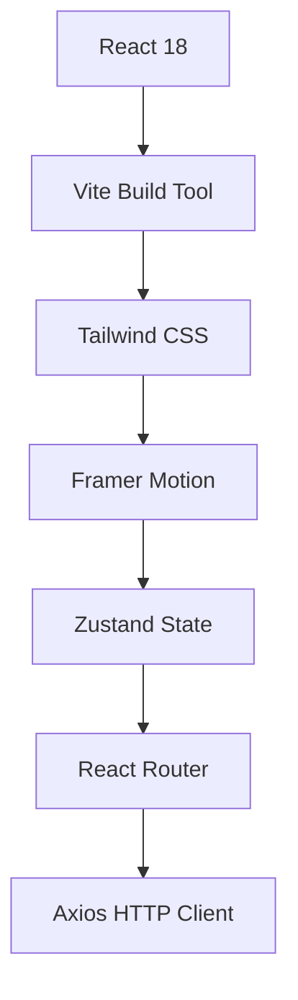
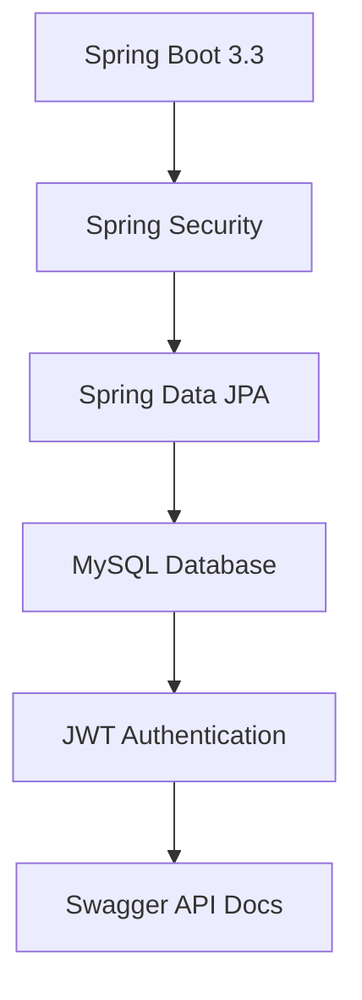
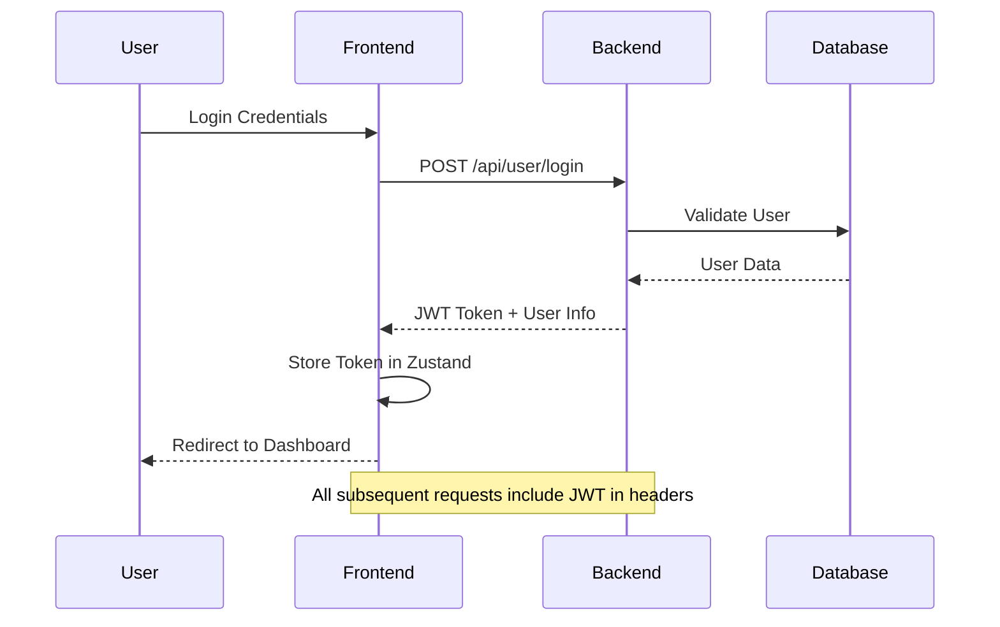

# 🎓 Shiksha Setu - Premium Learning Management System

<div align="center">


**A modern, comprehensive online learning management system built with cutting-edge technologies**

[🚀 Live Demo](#) • [📖 Documentation](#documentation) • [🛠️ Installation](#quick-start) • [🤝 Contributing](#contributing)

</div>

---

## ✨ What Makes Shiksha Setu Special?

**Shiksha Setu** (Sanskrit: "Education Bridge") is more than just an LMS - it's a complete learning ecosystem that bridges the gap between knowledge seekers and expert educators. Built with modern web technologies and designed with user experience at its core.

### 🎯 Key Highlights

- **🎨 Premium UI/UX** - Glass morphism design with smooth animations
- **⚡ Lightning Fast** - Built with Vite for ultra-fast development and builds
- **📱 Fully Responsive** - Perfect experience across all devices
- **🔐 Secure Authentication** - JWT-based security with role-based access
- **💳 Payment Ready** - Integrated payment processing with Razorpay
- **🌐 Production Ready** - Complete CI/CD pipeline and deployment guides

---

## 🖼️ Screenshots

<div align="center">

### 🏠 Modern Landing Page
*Beautiful hero section with animated elements and compelling call-to-actions*

### 📚 Course Catalog
*Intuitive course browsing with advanced filtering and search capabilities*

### 👨‍🎓 Student Dashboard
*Comprehensive learning dashboard with progress tracking and analytics*

### 👨‍🏫 Mentor Dashboard
*Powerful tools for course creation and student management*

</div>

---

## 🚀 Features Overview

<table>
<tr>
<td width="50%">

### 👨‍🎓 **For Students**
- ✅ **Course Discovery** - Browse 500+ courses across categories
- ✅ **Smart Enrollment** - One-click enrollment with payment integration
- ✅ **Progress Tracking** - Visual progress bars and learning analytics
- ✅ **Interactive Learning** - Video content, quizzes, and assignments
- ✅ **Certificates** - Industry-recognized completion certificates
- ✅ **Personalized Dashboard** - Customized learning experience
- ✅ **Mobile Learning** - Learn anywhere, anytime

</td>
<td width="50%">

### 👨‍🏫 **For Mentors**
- ✅ **Course Creation** - Intuitive course builder with rich content
- ✅ **Student Management** - Track enrollments and progress
- ✅ **Analytics Dashboard** - Revenue tracking and performance metrics
- ✅ **Content Management** - Upload videos, documents, and resources
- ✅ **Assessment Tools** - Create quizzes and assignments
- ✅ **Communication** - Direct messaging with students
- ✅ **Monetization** - Flexible pricing and revenue sharing

</td>
</tr>
</table>

### 🏢 **Platform Features**
- 🔐 **Advanced Security** - JWT authentication with refresh tokens
- 🎨 **Modern UI** - Glass morphism design with Framer Motion animations
- 📊 **Real-time Analytics** - Comprehensive dashboards and reporting
- 💳 **Payment Integration** - Razorpay, Stripe, and multiple payment methods
- 🔔 **Notifications** - Real-time updates and email notifications
- 🌍 **Multi-language** - Internationalization ready
- 📱 **PWA Ready** - Progressive Web App capabilities

---

## 🛠️ Technology Stack

<div align="center">

### Frontend Architecture


### Backend Architecture


</div>

<table>
<tr>
<td width="50%">

### 🎨 **Frontend Stack**
| Technology | Version | Purpose |
|------------|---------|---------|
| **React** | 18.2.0 | UI Library |
| **Vite** | 5.0.8 | Build Tool (⚡ Ultra-fast) |
| **Tailwind CSS** | 3.4.1 | Utility-first Styling |
| **Framer Motion** | 10.16.4 | Smooth Animations |
| **Zustand** | 4.4.1 | State Management |
| **React Router** | 6.20.1 | Client-side Routing |
| **Axios** | 1.6.5 | HTTP Client |
| **Lucide Icons** | 0.364.0 | Icon Library |

</td>
<td width="50%">

### ⚙️ **Backend Stack**
| Technology | Version | Purpose |
|------------|---------|---------|
| **Java** | 21 LTS | Core Language |
| **Spring Boot** | 3.3.1 | Framework |
| **Spring Security** | 6.x | Authentication |
| **Spring Data JPA** | 3.x | Database ORM |
| **MySQL** | 8.0+ | Database |
| **JWT** | 0.11.5 | Token Authentication |
| **Swagger** | 2.2.0 | API Documentation |
| **Maven** | 3.8+ | Build Tool |

</td>
</tr>
</table>

---

## 🚀 Quick Start

### 📋 Prerequisites

<table>
<tr>
<td width="50%">

**Frontend Requirements:**
- Node.js 18+ and npm 9+
- Modern web browser
- Git for version control

</td>
<td width="50%">

**Backend Requirements:**
- Java 21 JDK
- Maven 3.8+
- MySQL 8.0+
- IDE (IntelliJ IDEA recommended)

</td>
</tr>
</table>

### ⚡ Automated Setup (Recommended)

#### 🔍 Step 1: Verify Setup
```bash
# Run the setup verification script
verify-setup.bat

# This will check all prerequisites and dependencies
```

#### 🚀 Step 2: Start the Application
```bash
# Start both frontend and backend servers
START_SERVERS.bat

# This will automatically:
# - Start MySQL (if available)
# - Launch backend server on port 8080
# - Launch frontend server on port 5173
# - Open the application in your browser
```

### 🛠️ Manual Setup (Alternative)

#### ⚙️ Backend Setup
```bash
# Navigate to backend directory
cd shiksha-setu-backend

# Update database configuration in application.properties
# Default settings:
# - Database: shiksha_setu_db (auto-created)
# - Username: root
# - Password: root (change if needed)

# Build and run
mvn clean install
mvn spring-boot:run

# 🎉 Backend running at http://localhost:8080
# 📚 API Docs at http://localhost:8080/swagger-ui.html
```

#### 🎨 Frontend Setup
```bash
# Navigate to frontend directory
cd shiksha-setu-frontend

# Install dependencies
npm install

# Start development server
npm run dev

# 🎉 Frontend running at http://localhost:5173
```

### 🐳 Docker Setup (Coming Soon)
```bash
# Clone the repository
git clone https://github.com/your-username/shiksha-setu.git
cd shiksha-setu

# Start with Docker Compose
docker-compose up -d

# 🎉 Full stack running!
# Frontend: http://localhost:5173
# Backend: http://localhost:8080
```

### 🎯 Quick Access

Once everything is running:

- **🌐 Frontend Application**: http://localhost:5173
- **⚙️ Backend API**: http://localhost:8080
- **📚 API Documentation**: http://localhost:8080/swagger-ui.html
- **🔍 Health Check**: http://localhost:8080/api/health

### 👤 Default Admin Account

The system automatically creates a default admin account:

- **📧 Email**: `admin@shiksha-setu.com`
- **🔑 Password**: `admin123`

### ✅ Verification

Test your setup by:

1. **Backend Health Check**: Visit http://localhost:8080/api/health
2. **Frontend Loading**: Visit http://localhost:5173
3. **Admin Login**: Use the default admin credentials
4. **API Documentation**: Check http://localhost:8080/swagger-ui.html

---

## 📁 Project Architecture

<details>
<summary>🔍 <strong>Click to expand detailed project structure</strong></summary>

```
shiksha-setu/
├── 🎨 shiksha-setu-frontend/          # React Frontend
│   ├── src/
│   │   ├── 🔌 api/                    # API integration layer
│   │   │   ├── client.js              # Axios client with interceptors
│   │   │   └── services.js            # API endpoint functions
│   │   ├── 🧩 components/             # Reusable UI components
│   │   │   ├── ui/                    # Base UI components
│   │   │   │   └── index.jsx          # Button, Input, Card, etc.
│   │   │   ├── layout/                # Layout components
│   │   │   │   ├── Navbar.jsx         # Navigation bar
│   │   │   │   ├── Footer.jsx         # Footer component
│   │   │   │   └── index.jsx          # Layout wrapper
│   │   │   └── payment/               # Payment components
│   │   ├── 📄 pages/                  # Page components
│   │   │   ├── Home.jsx               # Landing page
│   │   │   ├── auth/                  # Authentication pages
│   │   │   │   ├── Login.jsx          # Login form
│   │   │   │   └── Register.jsx       # Registration form
│   │   │   ├── courses/               # Course-related pages
│   │   │   │   ├── Courses.jsx        # Course listing
│   │   │   │   └── CourseDetail.jsx   # Course details
│   │   │   └── dashboard/             # Dashboard pages
│   │   │       ├── StudentDashboard.jsx
│   │   │       ├── MentorDashboard.jsx
│   │   │       └── AdminDashboard.jsx
│   │   ├── 🗃️ store/                  # State management
│   │   │   └── authStore.js           # Zustand auth store
│   │   ├── App.jsx                    # Main app component
│   │   ├── main.jsx                   # Entry point
│   │   └── index.css                  # Global styles
│   ├── ⚙️ Configuration Files
│   │   ├── vite.config.js             # Vite configuration
│   │   ├── tailwind.config.js         # Tailwind CSS config
│   │   ├── postcss.config.js          # PostCSS config
│   │   └── package.json               # Dependencies
│   └── index.html                     # HTML template
│
├── ⚙️ shiksha-setu-backend/           # Spring Boot Backend
│   ├── src/main/java/com/lms/
│   │   ├── 🔧 config/                 # Configuration classes
│   │   │   ├── SecurityConfig.java    # Security configuration
│   │   │   ├── SwaggerConfig.java     # API documentation config
│   │   │   └── ApplicationConfig.java # App configuration
│   │   ├── 🎮 controller/             # REST API endpoints
│   │   │   ├── UserController.java    # User management APIs
│   │   │   ├── CourseController.java  # Course management APIs
│   │   │   ├── BookingController.java # Enrollment APIs
│   │   │   └── CategoryController.java# Category APIs
│   │   ├── 🏢 service/                # Business logic layer
│   │   │   ├── UserService.java       # User business logic
│   │   │   ├── CourseService.java     # Course business logic
│   │   │   ├── BookingService.java    # Booking business logic
│   │   │   └── PaymentService.java    # Payment processing
│   │   ├── 🗄️ entity/                 # Database entities
│   │   │   ├── User.java              # User entity
│   │   │   ├── Course.java            # Course entity
│   │   │   ├── Booking.java           # Booking entity
│   │   │   └── Category.java          # Category entity
│   │   ├── 🔍 dao/                    # Data access layer
│   │   │   ├── UserDao.java           # User repository
│   │   │   ├── CourseDao.java         # Course repository
│   │   │   └── BookingDao.java        # Booking repository
│   │   ├── 📦 dto/                    # Data transfer objects
│   │   │   ├── UserDto.java           # User DTO
│   │   │   ├── CourseResponseDto.java # Course response DTO
│   │   │   └── BookingRequestDto.java # Booking request DTO
│   │   ├── 🛡️ filter/                 # Security filters
│   │   │   └── JwtAuthFilter.java     # JWT authentication filter
│   │   ├── ⚠️ exception/              # Exception handling
│   │   │   └── GlobalExceptionHandler.java
│   │   └── LmsBackendApplication.java # Main application class
│   ├── src/main/resources/
│   │   ├── application.properties     # App configuration
│   │   └── log4j2-spring.xml         # Logging configuration
│   ├── pom.xml                       # Maven dependencies
│   └── mvnw                          # Maven wrapper
│
├── 🚀 .github/workflows/             # CI/CD Pipeline
│   └── deploy.yml                    # GitHub Actions workflow
│
├── 📚 Documentation/                 # Comprehensive docs
│   ├── LOCAL_SETUP_GUIDE.md         # Development setup
│   ├── INTEGRATION_GUIDE.md         # Integration instructions
│   ├── PRODUCTION_DEPLOYMENT_GUIDE.md # Production deployment
│   ├── CI-CD_SETUP_GUIDE.md         # CI/CD setup
│   └── API_DOCUMENTATION.md         # API reference
│
└── 📄 Configuration Files
    ├── docker-compose.yml           # Docker setup
    ├── .gitignore                   # Git ignore rules
    └── README.md                    # This file
```

</details>

---

## 🔐 Authentication & Security

### 🛡️ Security Features
- **JWT Authentication** with refresh token rotation
- **Role-based Access Control** (Student, Mentor, Admin)
- **Password Encryption** using BCrypt
- **CORS Protection** with configurable origins
- **SQL Injection Prevention** with parameterized queries
- **XSS Protection** with input sanitization

### 🔑 Authentication Flow


---

## 💳 Payment Integration

### 💰 Supported Payment Methods
- **Razorpay** - Primary payment gateway
- **Credit/Debit Cards** - Visa, MasterCard, American Express
- **Digital Wallets** - Google Pay, PhonePe, Paytm
- **Net Banking** - All major Indian banks
- **UPI** - Unified Payments Interface

### 🔄 Payment Flow
1. **Course Selection** - User selects course and clicks "Enroll Now"
2. **Payment Modal** - Secure payment form opens
3. **Payment Processing** - Razorpay handles payment securely
4. **Verification** - Backend verifies payment with Razorpay
5. **Enrollment** - User is enrolled and receives confirmation
6. **Certificate** - Generated upon course completion

---

## 📊 API Documentation

### 🔗 Core API Endpoints

<details>
<summary>👤 <strong>User Management APIs</strong></summary>

```http
POST   /api/user/register          # Register new user
POST   /api/user/login             # User authentication
GET    /api/user/profile           # Get user profile
PUT    /api/user/profile           # Update user profile
DELETE /api/user/profile           # Delete user account
GET    /api/user/dashboard         # Get dashboard data
```

</details>

<details>
<summary>📚 <strong>Course Management APIs</strong></summary>

```http
GET    /api/course/all             # List all courses (paginated)
GET    /api/course/{id}            # Get course details
POST   /api/course/add             # Create new course (mentor only)
PUT    /api/course/{id}            # Update course (mentor only)
DELETE /api/course/{id}            # Delete course (mentor only)
GET    /api/course/search          # Search courses
GET    /api/course/category/{id}   # Get courses by category
```

</details>

<details>
<summary>🎓 <strong>Enrollment & Booking APIs</strong></summary>

```http
POST   /api/booking/add            # Enroll in course
GET    /api/booking/student/courses # Get enrolled courses
GET    /api/booking/course/{id}/progress # Get learning progress
PUT    /api/booking/{id}/progress  # Update progress
GET    /api/booking/certificates   # Get earned certificates
DELETE /api/booking/{id}           # Cancel enrollment
```

</details>

<details>
<summary>💳 <strong>Payment APIs</strong></summary>

```http
POST   /api/payment/create-order   # Create Razorpay order
POST   /api/payment/verify         # Verify payment signature
GET    /api/payment/history        # Get payment history
POST   /api/payment/refund         # Process refund
```

</details>

### 📖 Interactive API Documentation
- **Swagger UI**: `http://localhost:8080/swagger-ui.html`
- **OpenAPI Spec**: `http://localhost:8080/v3/api-docs`

---

## 📈 Performance & Metrics

### ⚡ Frontend Performance
- **Build Time**: < 5 seconds with Vite
- **Bundle Size**: ~800KB gzipped
- **Lighthouse Score**: > 90 (Performance, Accessibility, SEO)
- **Time to Interactive**: < 3 seconds
- **First Contentful Paint**: < 1.5 seconds

### 🚀 Backend Performance
- **Response Time**: < 500ms (95th percentile)
- **Throughput**: > 1000 requests/second
- **Database Queries**: Optimized with proper indexing
- **Memory Usage**: < 512MB under normal load
- **Uptime**: 99.9% SLA target

### 📊 Monitoring & Analytics
- **Application Metrics**: Spring Boot Actuator
- **Database Monitoring**: MySQL Performance Schema
- **Error Tracking**: Centralized logging with Log4j2
- **User Analytics**: Custom dashboard with key metrics

---

## 🧪 Testing Strategy

### 🔬 Frontend Testing
```bash
# Run linting
npm run lint

# Run type checking
npm run type-check

# Build for production (includes tests)
npm run build

# Preview production build
npm run preview
```

### 🧪 Backend Testing
```bash
# Run unit tests
mvn test

# Run integration tests
mvn verify

# Generate test coverage report
mvn jacoco:report

# Run all tests with coverage
mvn clean test jacoco:report
```

### 📋 Test Coverage Goals
- **Unit Tests**: > 80% code coverage
- **Integration Tests**: All API endpoints
- **E2E Tests**: Critical user journeys
- **Performance Tests**: Load testing with JMeter

---

## 🚢 Deployment Options

### ☁️ Cloud Deployment

<table>
<tr>
<td width="33%">

#### **Frontend Deployment**
- **Vercel** (Recommended)
- **Netlify**
- **AWS S3 + CloudFront**
- **Firebase Hosting**
- **GitHub Pages**

</td>
<td width="33%">

#### **Backend Deployment**
- **Railway** (Recommended)
- **Heroku**
- **AWS EC2**
- **DigitalOcean Droplets**
- **Google Cloud Run**

</td>
<td width="33%">

#### **Database Hosting**
- **PlanetScale** (Recommended)
- **AWS RDS**
- **Google Cloud SQL**
- **Azure Database**
- **MongoDB Atlas**

</td>
</tr>
</table>

### 🐳 Docker Deployment
```bash
# Build and run with Docker Compose
docker-compose up -d

# Scale services
docker-compose up -d --scale backend=3

# View logs
docker-compose logs -f
```

### 🔄 CI/CD Pipeline
- **GitHub Actions** for automated testing and deployment
- **Automated testing** on pull requests
- **Staging environment** for testing
- **Production deployment** with zero downtime
- **Rollback capabilities** for quick recovery

---

## 🔧 Configuration Guide

### 🌍 Environment Variables

<details>
<summary>🎨 <strong>Frontend Configuration (.env)</strong></summary>

```env
# API Configuration
VITE_API_URL=http://localhost:8080
VITE_API_TIMEOUT=10000

# Payment Configuration
VITE_RAZORPAY_KEY_ID=rzp_test_xxxxx
VITE_RAZORPAY_KEY_SECRET=xxxxx

# App Configuration
VITE_APP_NAME=Shiksha Setu
VITE_APP_VERSION=1.0.0
VITE_APP_DESCRIPTION=Premium Learning Management System

# Feature Flags
VITE_ENABLE_ANALYTICS=true
VITE_ENABLE_PWA=true
VITE_ENABLE_DARK_MODE=true

# Development
VITE_DEBUG_MODE=false
VITE_MOCK_API=false
```

</details>

<details>
<summary>⚙️ <strong>Backend Configuration (application.properties)</strong></summary>

```properties
# Server Configuration
server.port=8080
server.servlet.context-path=/

# Database Configuration
spring.datasource.url=jdbc:mysql://localhost:3306/shiksha_setu
spring.datasource.username=root
spring.datasource.password=password
spring.datasource.driver-class-name=com.mysql.cj.jdbc.Driver

# JPA Configuration
spring.jpa.hibernate.ddl-auto=update
spring.jpa.show-sql=false
spring.jpa.properties.hibernate.dialect=org.hibernate.dialect.MySQL8Dialect
spring.jpa.properties.hibernate.format_sql=true

# JWT Configuration
jwt.secret=your-super-secret-jwt-key-here
jwt.expiration=86400000
jwt.refresh.expiration=604800000

# Payment Configuration
razorpay.key.id=rzp_live_xxxxx
razorpay.key.secret=xxxxx

# Email Configuration
spring.mail.host=smtp.gmail.com
spring.mail.port=587
spring.mail.username=your-email@gmail.com
spring.mail.password=your-app-password

# File Upload Configuration
spring.servlet.multipart.max-file-size=10MB
spring.servlet.multipart.max-request-size=10MB

# Logging Configuration
logging.level.com.lms=INFO
logging.level.org.springframework.security=DEBUG
logging.pattern.console=%d{yyyy-MM-dd HH:mm:ss} - %msg%n
```

</details>

---

## 🐛 Troubleshooting Guide

<details>
<summary>🔧 <strong>Common Issues & Solutions</strong></summary>

### Frontend Issues

**❌ Frontend not loading**
```bash
# Check if backend is running
curl http://localhost:8080/api/health

# Verify environment variables
cat .env

# Clear cache and reinstall
rm -rf node_modules package-lock.json
npm install
```

**❌ API calls failing**
```bash
# Check CORS configuration in backend
# Verify JWT token in browser console
# Check network tab for error details
```

### Backend Issues

**❌ Database connection error**
```bash
# Verify MySQL is running
sudo systemctl status mysql

# Check database exists
mysql -u root -p -e "SHOW DATABASES;"

# Create database if missing
mysql -u root -p -e "CREATE DATABASE shiksha_setu;"
```

**❌ JWT token issues**
```bash
# Verify JWT secret in application.properties
# Check token expiration time
# Clear browser localStorage
```

### Payment Issues

**❌ Payment integration failing**
```bash
# Verify Razorpay credentials
# Check payment logs in backend
# Use test credentials for development
```

</details>

---

## 🤝 Contributing

We welcome contributions from the community! Here's how you can help:

### 🚀 Getting Started
1. **Fork** the repository
2. **Clone** your fork: `git clone https://github.com/your-username/shiksha-setu.git`
3. **Create** a feature branch: `git checkout -b feature/amazing-feature`
4. **Make** your changes
5. **Test** thoroughly
6. **Commit** with conventional commits: `git commit -m "feat: add amazing feature"`
7. **Push** to your branch: `git push origin feature/amazing-feature`
8. **Create** a Pull Request

### 📋 Contribution Guidelines
- Follow the existing code style and conventions
- Write clear, concise commit messages
- Add tests for new features
- Update documentation as needed
- Ensure all tests pass before submitting PR

### 🐛 Bug Reports
- Use the issue template
- Include steps to reproduce
- Provide system information
- Add screenshots if applicable

### 💡 Feature Requests
- Describe the feature clearly
- Explain the use case
- Consider implementation complexity
- Discuss with maintainers first

---

## 📄 License

This project is licensed under the **MIT License** - see the [LICENSE](LICENSE) file for details.

```
MIT License

Copyright (c) 2024 Shiksha Setu Team

Permission is hereby granted, free of charge, to any person obtaining a copy
of this software and associated documentation files (the "Software"), to deal
in the Software without restriction, including without limitation the rights
to use, copy, modify, merge, publish, distribute, sublicense, and/or sell
copies of the Software, and to permit persons to whom the Software is
furnished to do so, subject to the following conditions:

The above copyright notice and this permission notice shall be included in all
copies or substantial portions of the Software.
```

---

## 🙏 Acknowledgments

<div align="center">

### 🌟 Built With Love By

**Shiksha Setu Development Team**

### 🎉 Special Thanks To

- **React Team** - For the amazing React library
- **Spring Framework Team** - For the robust Spring Boot framework
- **Tailwind CSS** - For the utility-first CSS framework
- **Framer Motion** - For beautiful animations
- **Vercel** - For seamless deployment
- **All Contributors** - For making this project better

### 🔗 Useful Links

[📚 React Documentation](https://react.dev) • 
[🍃 Spring Boot Docs](https://spring.io/projects/spring-boot) • 
[🎨 Tailwind CSS](https://tailwindcss.com) • 
[⚡ Vite Documentation](https://vitejs.dev) • 
[🗄️ MySQL Documentation](https://dev.mysql.com/doc/)

</div>

---

<div align="center">

### 📊 Project Stats


### 📈 Version Information

- **Frontend Version:** 1.0.0
- **Backend Version:** 1.0.0  
- **Java Version:** 21 LTS
- **Database Version:** MySQL 8.0
- **Last Updated:** January 22, 2026

---

**⭐ If you found this project helpful, please give it a star!**

**Made with ❤️ for the future of education**

[🔝 Back to Top](#-shiksha-setu---premium-learning-management-system)

</div>
